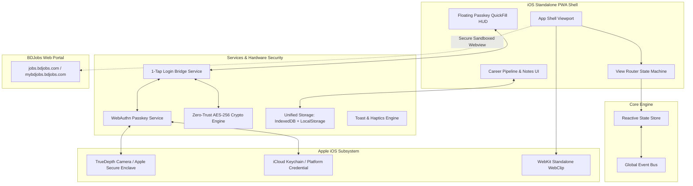
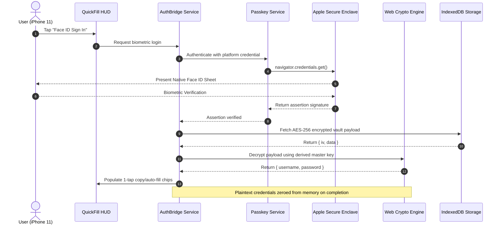

# BD Career Hub — System Architecture Blueprint 🏛️

This document describes the high-level system design, modular component hierarchy, data-flow pipelines, and security threat models of the **BD Career Hub Progressive Web App**.

---

## 🏗️ 1. High-Level Architectural Diagram



---

## 🧱 2. Component Directory Hierarchy

```
js/
├── core/
│   ├── store.js             # Reactive central state store (Unidirectional data-flow)
│   └── event-bus.js         # Decoupled global event emitter (PubSub)
├── services/
│   ├── storage.service.js   # Asynchronous IndexedDB + LocalStorage fallback
│   ├── crypto.service.js    # AES-256-GCM, PBKDF2 derivation & memory zeroing
│   ├── passkey.service.js   # W3C WebAuthn Level 2/3 biometric ceremonies
│   └── auth-bridge.service.js # 1-Tap Face ID credential vault & auto-login dispatcher
├── ui/
│   ├── router.js            # View state machine (Launchpad, Portal, Pipeline, Modals)
│   ├── pipeline.js          # 5-stage career pipeline & notes manager
│   └── notifications.js     # Unified iOS Toast & Haptic feedback system
├── app.js                   # Application coordinator & entrypoint
├── passkey.js               # Backward-compatible facade
├── auth-bridge.js           # Backward-compatible facade
└── pwa.js                   # Service Worker & PWA lifecycle coordinator
```

---

## 🔒 3. Biometric Passkey & Encryption Lifecycle



---

## ⚡ 4. Storage Architecture (Hybrid IndexedDB + LocalStorage)

- **IndexedDB**: Asynchronous non-blocking storage for large payloads, career pipeline listings, and custom notes.
- **LocalStorage**: Instant synchronous read on startup for fast bootstrap before DOM ready.
- **Quota Resilience**: Automatic fallback gracefully handles private browsing quota limits without throwing runtime exceptions.

---

## 🛡️ 5. Zero-Trust Security Guarantees

1. **Client-Side Isolation**: No third-party servers, no analytics beacons, zero telemetry.
2. **Hardware-Tied Keys**: WebAuthn private keys are held exclusively inside Apple's Secure Enclave.
3. **Memory Sanitization**: Plaintext credentials decrypted in RAM are zeroed upon session completion or auto-dismiss timeout.
